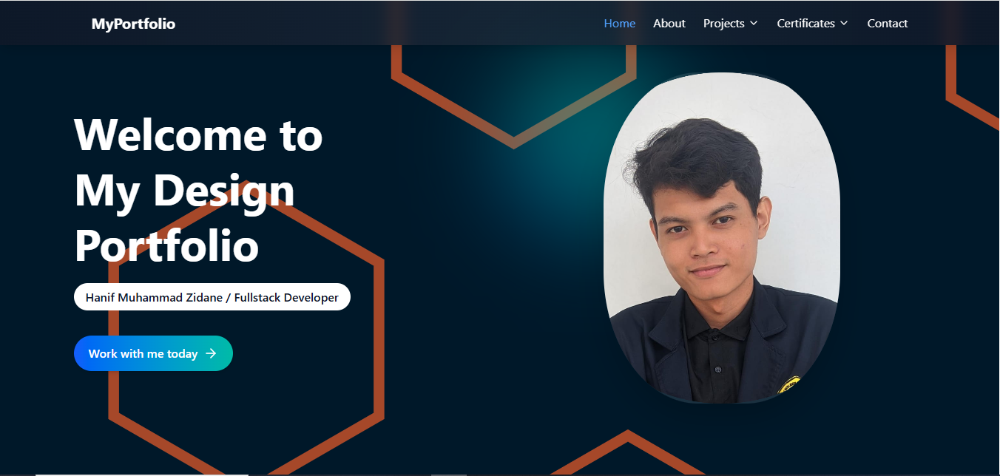
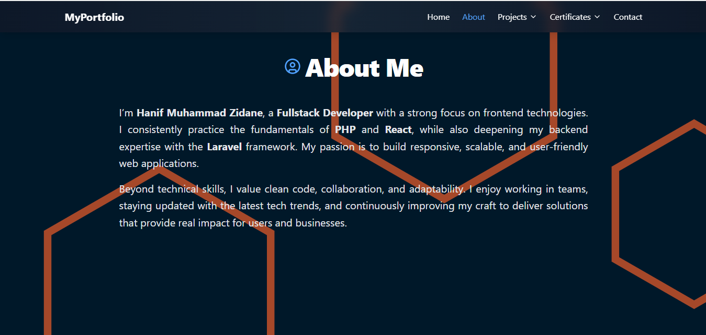
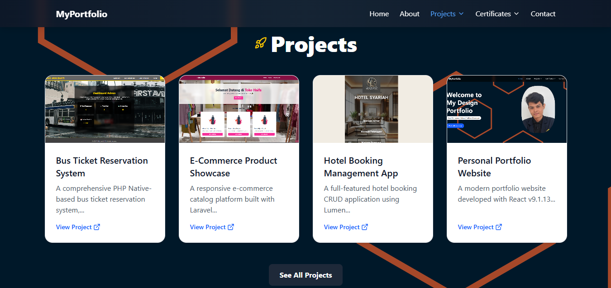
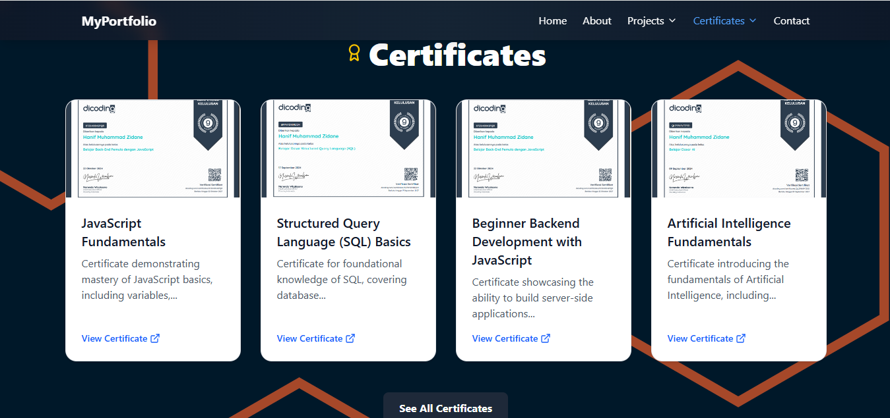
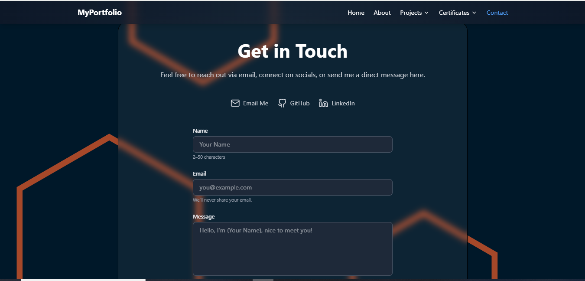
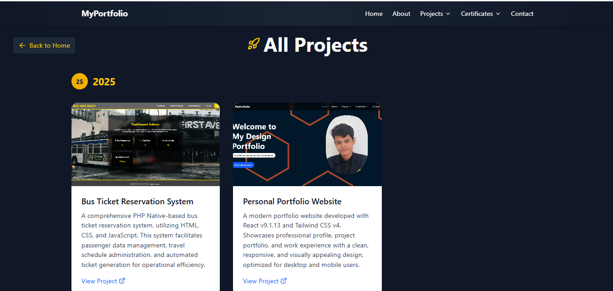
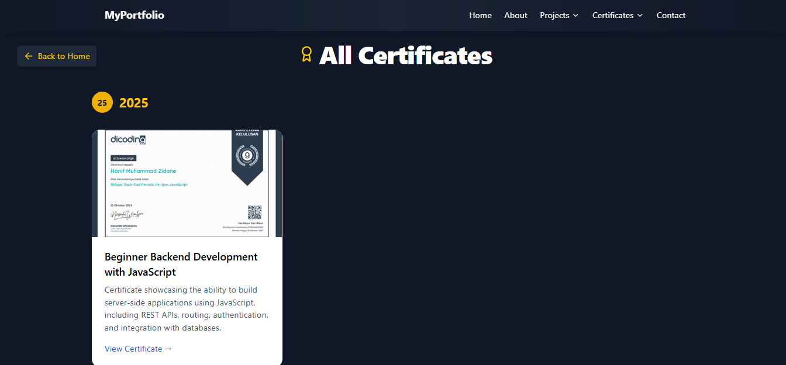

<h1 align="center">
  ✨ <span style="background: linear-gradient(90deg,#00c6ff,#0072ff); -webkit-background-clip: text; color: transparent;">Portfolio v2</span> ✨
</h1>

<p align="center">
  🚀 Dibangun dengan <b>React + Vite</b> & <b>TailwindCSS v4</b>  
</p>

<p align="center">
  <a href="https://portfolio-v2-wild-sku.vercel.app"></a>
  <a href="./LICENSE"></a>
  <a href="https://github.com/username/portfolio-v2/stargazers"></a>
  <a href="https://github.com/username/portfolio-v2/commits/main"></a>
</p>

---

## 🎊 About
**Portfolio v2** adalah website portfolio modern yang dibangun dengan **React + Vite** dan **TailwindCSS v4**.  
Tujuannya adalah untuk menampilkan **proyek, keterampilan, dan pengalaman** dengan desain **clean, responsif, dan cepat**.  

🌍 **Live Demo**: [portfolio-v2-wild-sku.vercel.app](https://portfolio-v2-wild-sku.vercel.app)  

---

## 🛠️ Tech Stack
- ⚛️ [React 18+](https://react.dev/) — UI Library  
- ⚡ [Vite](https://vitejs.dev/) — Build Tool & Dev Server  
- 🎨 [TailwindCSS v4](https://tailwindcss.com/) — Utility-first CSS Framework  
- 🌩️ [Vercel](https://vercel.com/) — Hosting & Deployment  

---

## ✨ Features
✅ **Responsive Design** (Mobile-first)  
✅ **Clean & Modern UI**  
✅ **Fast Build** with Vite  
✅ **Dark Mode Ready** 🌙  
✅ **Easy to Customize**  

---

## 📸 Preview
  
  
  
  
  
  
  

---

## 📦 Installation & Setup

Clone repository ini ke lokal:

```bash
# Clone repo
git clone https://github.com/username/portfolio-v2.git

# Masuk ke folder project
cd portfolio-v2

# Install dependencies
npm install

# Jalankan development server
npm run dev

# Build untuk production
npm run build

# Preview hasil build
npm run preview
